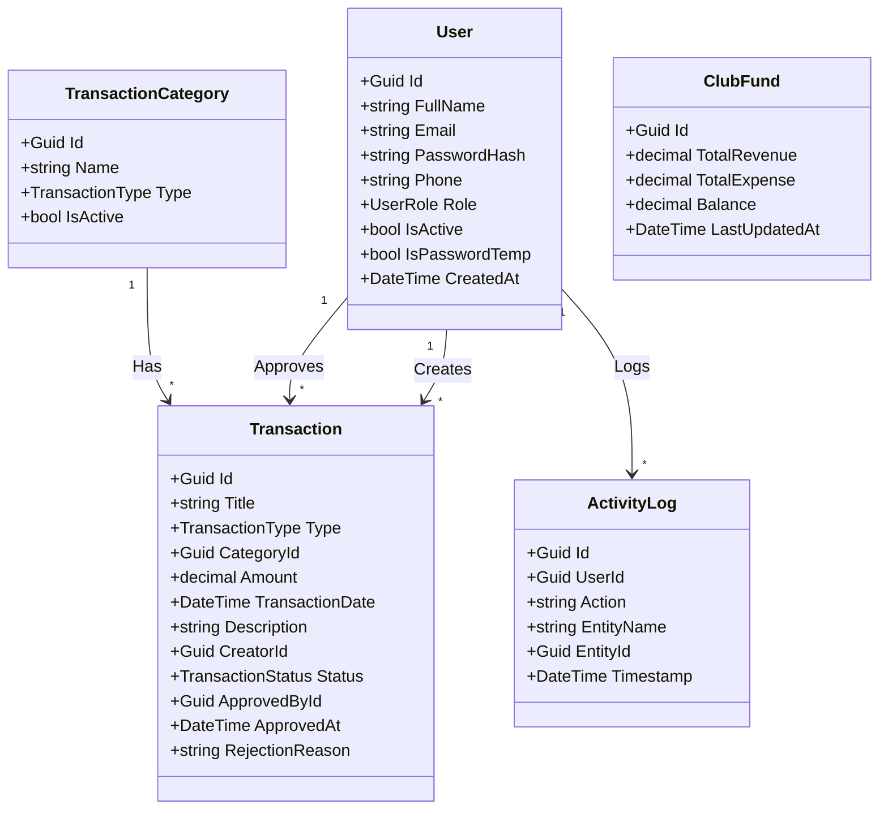

# FinCore - Quy Chuẩn Code & Cấu Trúc Dự Án (Coding Rules & Architecture)

Tài liệu này chứa toàn bộ quy chuẩn viết code, cấu trúc thư mục, thiết kế cơ sở dữ liệu và ý tưởng thiết kế UI cho dự án quản lý tài chính câu lạc bộ **FinCore**.

---

## 1. Yêu Cầu Nghiệp Vụ Đặc Thù (Business Rules)
* **Không tự đăng ký tài khoản:** Hệ thống không cung cấp chức năng đăng ký công khai.
* **Quy trình cấp tài khoản:**
  1. Ban quản lý (Admin) tạo tài khoản mới qua màn hình quản trị bằng cách điền: Họ tên, Email, Số điện thoại, Vai trò (Admin/Member).
  2. Hệ thống tạo tài khoản, sinh mật khẩu tạm thời.
  3. Thành viên đăng nhập lần đầu bằng mật khẩu tạm và bắt buộc phải cập nhật mật khẩu mới để kích hoạt tài khoản (`IsPasswordTemp = false`).
* **Trạng thái tài khoản:** Khi thành viên rời CLB, tài khoản chuyển sang `Inactive` thay vì xóa để bảo toàn lịch sử giao dịch.

---

## 2. Quy Chuẩn Viết Code (Coding Rules)

### 2.1 Backend (.NET)
* **Môi trường:** .NET 8, C# 12. Bật `Nullable` và `ImplicitUsings`.
* **Quy tắc đặt tên (Naming Conventions):**
  * **PascalCase:** Tên Class, Method, Property, Namespace, Enum (ví dụ: `UserService`, `GetActiveUsers`, `Email`).
  * **camelCase:** Tham số method, biến cục bộ (ví dụ: `userId`, `transactionAmount`).
  * **_camelCase:** Biến private readonly (ví dụ: `_dbContext`).
  * **UPPER_CASE:** Hằng số (ví dụ: `MAX_UPLOAD_SIZE_MB`).
* **Thiết kế & Kiến trúc:**
  * Sử dụng **Clean Architecture** (Onion Architecture).
  * Sử dụng **EF Core Code-First** để quản lý cơ sở dữ liệu **SQL Server**.
  * Sử dụng **MediatR (CQRS)** tách biệt logic ghi (Commands) và đọc (Queries).
  * Sử dụng **FluentValidation** thay thế Data Annotations.
  * Xử lý lỗi tập trung bằng **Exception Middleware** trả về định dạng `ProblemDetails`.

### 2.2 Frontend (Next.js)
* **Môi trường:** Next.js 14+ (App Router), TypeScript, Tailwind CSS, Shadcn UI.
* **Quy tắc đặt tên:**
  * **PascalCase:** Tên React Component (`UserTable.tsx`, `Sidebar.tsx`).
  * **camelCase:** Custom hooks, Helper functions, API services (`useAuth.ts`, `formatCurrency.ts`).
* **Quy tắc Next.js:**
  * Phân chia rõ ràng giữa Server Components và Client Components (`"use client"`).
  * Sử dụng **Zod** phối hợp **React Hook Form** để validate biểu mẫu.

---

## 3. Cấu Trúc Thư Mục (Project Directory Structure)

### 3.1 Backend (.NET Web API)
```text
FinCore.Backend/
├── FinCore.Domain/                  # Lớp chứa Entities, Enums, Domain Logic
│   ├── Entities/                    # User, Transaction, TransactionCategory, ClubFund...
│   ├── Enums/                       # UserRole, TransactionStatus, TransactionType
│   └── Exceptions/
│
├── FinCore.Application/             # Lớp chứa Application Logic, DTOs, CQRS Handlers
│   ├── Common/                      # Mappings, Behaviors
│   ├── Interfaces/                  # IDbContext, IEmailService, ITokenService
│   ├── Features/                    # Tổ chức code theo tính năng (Feature-based)
│   │   ├── Users/
│   │   │   ├── Commands/            # CreateUserCommand, UpdateUserCommand
│   │   │   ├── Queries/             # GetUserDetailQuery, GetUsersQuery
│   │   │   └── DTOs/
│   │   └── Transactions/
│   └── Validators/
│
├── FinCore.Infrastructure/          # Kết nối CSDL (EF Core), Mail, JWT Services
│   ├── Persistence/
│   │   ├── ApplicationDbContext.cs
│   │   └── Configurations/          # Fluent API
│   ├── Services/
│   └── Identity/
│
└── FinCore.API/                     # API Controller, Middleware, Configuration
    ├── Controllers/
    ├── Middlewares/
    └── Program.cs
```

### 3.2 Frontend (Next.js App Router)
```text
fincore-frontend/
├── public/
├── src/
│   ├── app/                         # Routing & Pages
│   │   ├── (auth)/                  # Login, First-time Password Reset
│   │   ├── (dashboard)/             # Main Layout, Sidebar
│   │   │   ├── admin/               # Quản lý người dùng, Duyệt giao dịch
│   │   │   ├── transactions/        # Danh sách & Thêm thu chi
│   │   │   └── reports/             # Báo cáo tài chính
│   │   ├── page.tsx                 # Trang giới thiệu CLB
│   │   └── layout.tsx
│   │
│   ├── components/                  # Shared Components
│   │   ├── ui/                      # shadcn/ui components
│   │   ├── charts/                  # Recharts components
│   │   └── shared/                  # Header, Sidebar, DataTable
│   │
│   ├── hooks/                       # useAuth, useFetch...
│   ├── services/                    # API Service Calls
│   ├── types/                       # TypeScript Definitions
│   ├── utils/                       # formatCurrency, formatDate...
│   └── middleware.ts                # Route Guard (Auth check)
```

---

## 4. Thiết Kế Cơ Sở Dữ Liệu (Code-First Entities)



---

## 5. Ý Tưởng Thiết Kế Giao Diện (UI/UX Concept)

### 5.1 Giao diện Sáng/Tối (Theme & Brand)
* **Tone màu:** Nền `#F8FAFC` (Sáng) hoặc `#0B0F19` (Tối). Màu thương hiệu chủ đạo là Xanh mòng két (Teal `#0D9488`) tạo sự sang trọng và tin cậy cho ứng dụng tài chính.
* **Font chữ:** `Outfit` tạo giao diện thanh thoát và số liệu trực quan.

### 5.2 Luồng Thiết Kế Quản Lý Người Dùng (Admin Provisioning)
1. **Màn hình Danh sách Người dùng:**
   * Hiển thị bảng dạng danh sách (DataTable) với tính năng tìm kiếm, lọc theo vai trò (Admin/Member) và trạng thái (Hoạt động/Bị khóa).
   * Có nút chuyển đổi nhanh (Toggle switch) để Khóa/Mở khóa tài khoản thành viên.
2. **Luồng Cấp Tài Khoản Mới:**
   * Admin nhấn nút **"Cấp tài khoản"** -> Mở Drawer (Bảng trượt từ bên phải màn hình).
   * Form gồm các trường: Họ tên, Email, Số điện thoại, Vai trò.
   * Khi nhấn gửi, hệ thống hiển thị màn hình thông báo: **"Đã cấp tài khoản thành công!"** kèm thông tin mật khẩu tạm thời tự động sinh dạng chữ và số phức tạp (Ví dụ: `FinCore@892a`).
   * Có nút **"Copy thông tin đăng nhập"** để Admin gửi cho thành viên qua Zalo, Messenger hoặc email.
3. **Màn hình Bắt Buộc Đổi Mật Khẩu (Lần đầu đăng nhập):**
   * Nếu người dùng đăng nhập bằng tài khoản có trạng thái mật khẩu tạm thời (`IsPasswordTemp == true`), hệ thống hiển thị màn hình khóa với form: **Mật khẩu cũ**, **Mật khẩu mới**, **Nhập lại mật khẩu mới**.
   * Chỉ khi đổi mật khẩu thành công mới được chuyển hướng vào trang chủ Dashboard.
